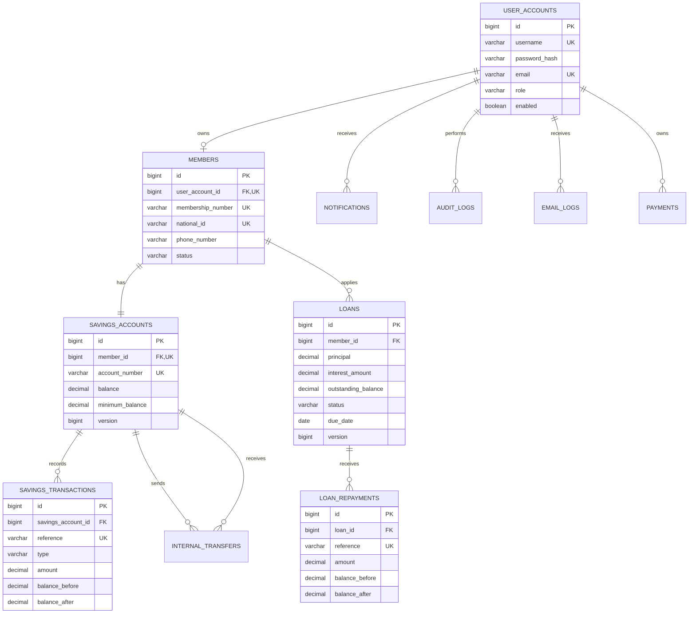

# Database schema

The diagram is derived from the JPA entities in `org.joel.kimwanyisacco.model`.

Hibernate maintains the local development schema when `HIBERNATE_DDL_AUTO=update`.
Production deployments should use reviewed migrations and `validate` mode.
