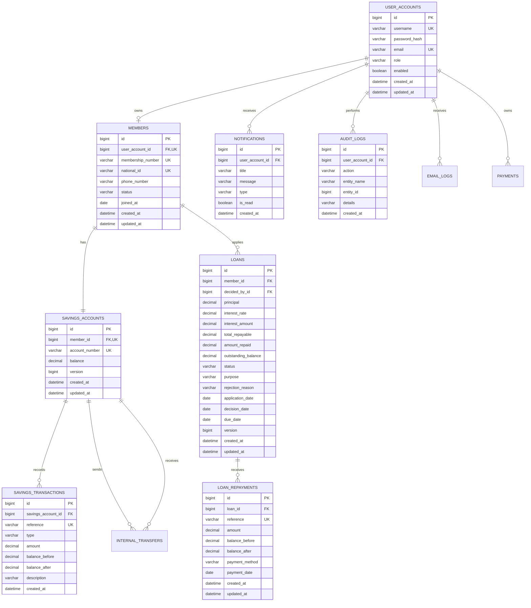

# Kimwanyi SACCO Management System: Entity Relationship Diagram (ERD) & Database Schema

This guide provides the Entity Relationship Diagram (ERD) and a detailed explanation of the database tables, keys, fields, and relationships.

---

## 1. Entity Relationship Diagram (Mermaid Visualization)

---

## 2. Explanation of Core Database Relationships

### A. One-to-One Relationships (1 : 1)
* **`USER_ACCOUNTS` $\leftrightarrow$ `MEMBERS`**:
  - **Relationship**: A single login credential account (`USER_ACCOUNTS`) owns exactly one cooperative member profile (`MEMBERS`). An admin user, however, has a login account but does not have a member profile record.
  - **Foreign Key**: `members.user_account_id` $\rightarrow$ `user_accounts.id` (Unique).
* **`MEMBERS` $\leftrightarrow$ `SAVINGS_ACCOUNTS`**:
  - **Relationship**: Each cooperative member has exactly one savings account to deposit or withdraw funds.
  - **Foreign Key**: `savings_accounts.member_id` $\rightarrow$ `members.id` (Unique).

### B. One-to-Many Relationships (1 : N)
* **`MEMBERS` $\rightarrow$ `LOANS`**:
  - **Relationship**: A member can apply for multiple loans over time. However, business policies enforce that they can only have one *active* or *pending* loan at a single time.
  - **Foreign Key**: `loans.member_id` $\rightarrow$ `members.id`.
* **`LOANS` $\rightarrow$ `LOAN_REPAYMENTS`**:
  - **Relationship**: A single loan accumulates multiple repayments over its lifecycle until the outstanding balance reaches zero.
  - **Foreign Key**: `loan_repayments.loan_id` $\rightarrow$ `loans.id`.
* **`SAVINGS_ACCOUNTS` $\rightarrow$ `SAVINGS_TRANSACTIONS`**:
  - **Relationship**: A savings account accumulates a ledger log of all deposits, withdrawals, internal transfers, and interest postings.
  - **Foreign Key**: `savings_transactions.savings_account_id` $\rightarrow$ `savings_accounts.id`.
* **`USER_ACCOUNTS` $\rightarrow$ `NOTIFICATIONS` & `AUDIT_LOGS`**:
  - **Relationship**: Users (both members and admins) receive multiple notifications and produce multiple security or financial audit log trails.

---

## 3. Important Table Key Constraints

1. **Unique Indexes (UK)**:
   - `user_accounts.username`: Avoids duplicate login names.
   - `user_accounts.email`: Avoids multiple logins sharing the same email address.
   - `members.national_id`: Enforces that each member registers with a unique National Identification Card.
   - `members.membership_number`: Enforces uniquely sequential membership numbering (e.g. `KIM-001`).
   - `savings_accounts.account_number`: Enforces unique account identification (e.g. `SAV-129847`).
   - `savings_transactions.reference`: Guarantees transaction idempotency (e.g., prevents crediting interest twice).
2. **JPA Version Columns (Optimistic Locking)**:
   - `savings_accounts.version` & `loans.version` use JPA `@Version` counters. This prevents **race conditions** (e.g. if two threads try to withdraw or apply repayments concurrently, the transaction that commits second will fail rather than overwriting balance calculations).
3. **Foreign Keys (FK)**:
   - Enforce database referential integrity. Deleting a record with active dependent relations is blocked.
